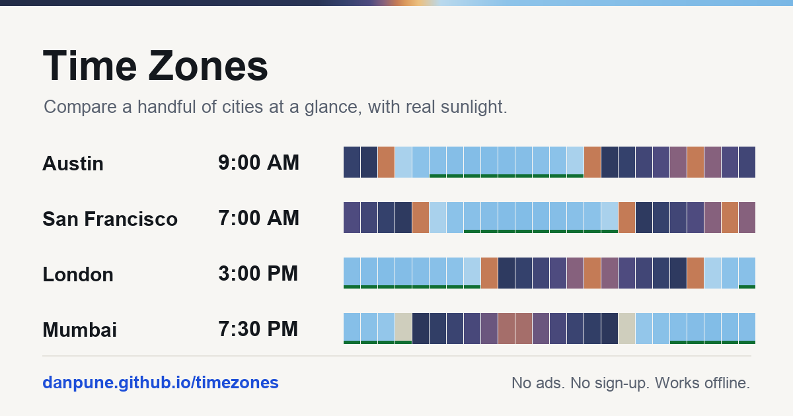

# Time Zones

Compare cities at a glance, with real sunrise, sunset and daylight for each one.

**→ [danpune.github.io/timezones](https://danpune.github.io/timezones/)**



One static HTML file. No build step, no dependencies, no backend, no API key, no
account, no ads, no tracking. Works offline once loaded.

## What it does

- **Live clock per city**, exact to the minute, ticking on its own.
- **A real day, not a guess.** Each city's 24-hour strip is painted with its actual
  sky, computed from that city's latitude and longitude: night, twilight, dawn,
  daylight. Sunrise and sunset use the standard −0.833° refraction correction and
  match Apple's World Clock to the minute.
- **One line across every city.** Drag the hours, or tap the time and type one
  (`3pm`, `15:30`), and a single thread marks that instant in every zone.
- **Relative to you.** Every card says how far it is from wherever you are.
- **Overlap finder.** Names the hours everyone is at work, or says plainly that none exist.
- **Shareable link.** The whole comparison lives in the URL:
  `#Austin,London,Mumbai&b=London&d=2026-09-14&t=09:30`
- **Copy times** as a plain text block for mail or chat.
- **Rename and reorder.** Call a city "Mom" if that is what it is. Drag ⠿ to reorder.
- 418 IANA zones and ~60 named cities. "Eastern Time", "PST", "IST" and "GMT" all resolve.
- Light and dark, and installable to a phone home screen.

## Why

Daylight saving is the thing every homemade converter gets wrong. This one asks the
device's own time zone database, so it is always current. Everything else — the sun,
the sky, the day length — is computed locally, which is why the page still works with
no connection.

## Run it

```
python3 -m http.server 8000
```

Then open `http://localhost:8000/`. That is the whole build system.

## Licence

[MIT](LICENSE).
